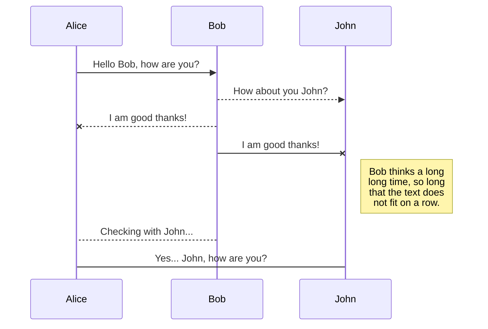

## KaTeX
You can render LaTeX mathematical expressions using KaTeX:

The Gamma function satisfying Γ(n) = (n-1)! ∀ n∈\mathbb N is via the Euler integral

$$
Γ(z) = \int₀^∞ tᶻ⁻¹e⁻ᵗdt\,.
$$


> You can find more information about LaTeX mathematical expressions here.

## UML diagrams

You can render UML diagrams using Mermaid. For example, this will produce a sequence diagram:


                                                                                                                                                                                                                   
And this will produce a flow chart:                                                                                                                                                                                
                                                                                                                                                                                                                   
```mermaid                                                                                                                                                                                                         
graph LR                                                                                                                                                                                                           
A[Square Rect] -- Link text --> B((Circle))                                                                                                                                                                        
A --> C(Round Rect)                                                                                                                                                                                                
B --> D{Rhombus}                                                                                                                                                                                                   
C --> D                                                                                                                                                                                                            
```
