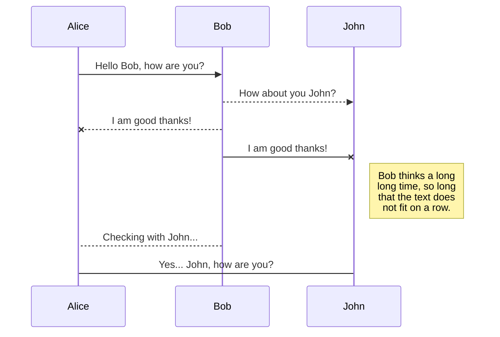

## KaTeX
You can render LaTeX mathematical expressions using KaTeX:

The *Gamma function* satisfying $\Gamma(n) = (n-1)!\quad\forall n\in\mathbb N$ is written with   `$\Gamma(n) = (n-1)!\quad\forall n\in\mathbb N$`

The Euler integral:

$$
\Gamma(z) = \int_0^\infty t^{z-1}e^{-t}dt\,.
$$

is written with:

```latex
$$
\Gamma(z) = \int_0^\infty t^{z-1}e^{-t}dt\,.
$$
```


> You can find more information about **LaTeX** mathematical expressions [here](https://meta.math.stackexchange.com/questions/5020/mathjax-basic-tutorial-and-quick-reference).

## UML diagrams

You can render UML diagrams using [Mermaid](https://mermaidjs.github.io/). For example, this will produce a sequence diagram:




                                                                                                                                                                                                                   
And this will produce a flow chart:                                                                                                                                                                                
                                                                                                                                                                                                                   
```mermaid                                                                                                                                                                                                         
graph LR                                                                                                                                                                                                           
A[Square Rect] -- Link text --> B((Circle))                                                                                                                                                                        
A --> C(Round Rect)                                                                                                                                                                                                
B --> D{Rhombus}                                                                                                                                                                                                   
C --> D                                                                                                                                                                                                            
```
