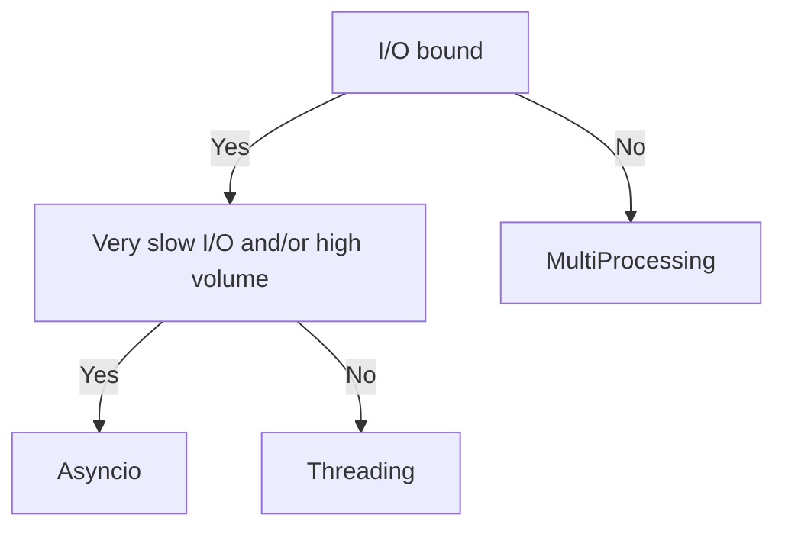

## TL;DR


    
## Introduction
### Threads vs Multiprocessing
The difference between threads and processes is that threads share the same memory space, while processes have separate memory spaces (and separate python interpreter). This makes threads more lightweight than processes. But it also makes threads more error-prone since they can interfere with each other.

In this post we will also compare how threading in Python and C++. There is a big difference in how threads are implemented in the two languages. Python has a Global Interpreter Lock (GIL) which makes it difficult to run threads in parallel. All threads do run concurrently, but only one thread can execute Python code at a time. C++ threads do not have this limitation.

### Asyncio
Asyncio (introduced in Python 3.4) is another way to run multiple tasks concurrently in Python. It is best used for I/O-bound tasks. It uses a single thread to run multiple tasks concurrently.

## Python Threading 
### Threading in Python
Python has a Global Interpreter Lock (GIL) which prevents "true" threading. The GIL is a mutex (mutual exclusion) that protects access to Python objects, preventing memory corruption. This means that only one thread can execute Python code at a time. This makes Python threads unsuitable for CPU-bound tasks, but they are still useful for e.g. I/O-bound tasks. 

In Python, the `threading` module is used to create and manage threads. Here is an example of how to create a thread in Python which runs concurrently with the main program:

```python
import threading
import time

def counter():
    for i in range(10):
        print(i)
        time.sleep(1e-3)


thread = threading.Thread(target=worker)
thread.start()
print("Main programing is running while the thread is executing")
thread.join()
print("Thread has finished")
```

### I/O-bound tasks
Here is an example of how to download a list of urls concurrently using threads. This is a common use case for threads in Python since downloading files is often I/O-bound:

```python
import threading
import requests

def download(url, filename):
    response = requests.get(url)
    print(f"Downloaded {url}")
    if response.status_code == 200:
        with open(filename, 'wb') as f:
            f.write(response.content)
            print(f"Saved {filename}")
    else:
        print(f"Failed to download {url}")


# URLs of the files you want to download
urls = [
    "http://example.com/file1.pdf",
    "http://example.com/file2.pdf",
    "http://example.com/file3.jpg"
]

# Create a thread for each url

threads = []

for i, url in enumerate(urls):
    thread = threading.Thread(target=download, args=(url, f"file{i}"))
    thread.start()
    threads.append(thread)

# Wait for all threads to finish
for thread in threads:
    thread.join()

print("All downloads are finished")
```

### CPU-bound tasks can be slowed down by the GIL

Here is an example of how the GIL can slow down CPU-bound tasks. The following code will not run in parallel since the GIL prevents it:

```python
import threading
import time

def counter():
    for i in range(1000):
        pass


threads = []
start=time.time()
for i in range(4):
    thread = threading.Thread(target=counter)
    thread.start()
    threads.append(thread)

for thread in threads:
    thread.join()
finish=time.time()
print("All threads are finished")
print(f"Time taken: {finish-start}")
```
The output when testing was:
```bash
All threads are finished
Time taken: 0.028651952743530273
```
while running without threads:

```python
def counter():
    for i in range(10**6):
        pass


threads = []
start=time.time()
for i in range(4):
    counter()

finish=time.time()
print("All threads are finished")
print(f"Time taken: {finish-start}")
```
yielded:
```bash
All threads are finished
Time taken: 0.02545785903930664
```
Actually a bit faster without threads.

## Threading in C++

In C++ threads are part of the standard library since C++11. The `std::thread` class is used to create and manage threads. Here is an example of how to create a corresponding counter script in C++:

```cpp
#include <iostream>
#include <thread>
#include <vector>
#include <chrono>

void counter() {
    for (int i = 0; i < 1e9; ++i) {
        // Just a simple loop to simulate work
    }
}

int main() {
    std::vector<std::thread> threads;
    auto start = std::chrono::high_resolution_clock::now();

    for (int i = 0; i < 4; ++i) {
        threads.push_back(std::thread(counter));
    }

    for (auto& thread : threads) {
        thread.join();
    }

    auto finish = std::chrono::high_resolution_clock::now();
    std::chrono::duration<double> elapsed = finish - start;

    std::cout << "All threads are finished" << std::endl;
    std::cout << "Time taken: " << elapsed.count() << " seconds" << std::endl;

    return 0;
}
```
Compiling with `g++ -std=c++23 main -pthread main.cpp -o main` yielded:

```bash
All threads are finished
Time taken: 0.269896 seconds
```

And without threads:
```cpp

#include <iostream>
#include <chrono>

void counter() {
    for (int i = 0; i < 1e9; ++i) {
        // Just a simple loop to simulate work
    }
}

int main() {
    auto start = std::chrono::high_resolution_clock::now();

    for (int i = 0; i < 4; ++i) {
        counter();
    }

    auto finish = std::chrono::high_resolution_clock::now();
    std::chrono::duration<double> elapsed = finish - start;

    std::cout << "All threads are finished" << std::endl;
    std::cout << "Time taken: " << elapsed.count() << " seconds" << std::endl;

    return 0;
}
```
yielded:
```bash
All threads are finished
Time taken: 0.860533 seconds
```
which is quite a bit slower than with threads.

## Multiprocessing in Python
To run multiple tasks concurrently without using threads (which is limited by the GIL), we can use the `multiprocessing` module in Python. The `multiprocessing` module allows us to create multiple processes, each with its own memory space *and* its own Python interpreter. This means that the processes can run in parallel and possibly utilize multiple CPU cores. If you have a CPU-bound task, multiprocessing is a good choice.


### Mulitprocessin example
```python
import multiprocessing
import time

def cpu_bound_task(x):
    count = 0
    for i in range(int(1e8)):
        count += i
    return count

if __name__ == "__main__":
    start_time = time.time()

    inputs = [1, 2, 3, 4]

    # Create a pool of processes
    with multiprocessing.Pool() as pool:
        # Map cpu_bound_task to the inputs and execute in parallel
        results = pool.map(cpu_bound_task, inputs)

    print(f"Time taken: {time.time() - start_time} seconds")
    print("Results:", results)

```
yields
```bash
Time taken: 1.7265195846557617 seconds
Results: [4999999950000000, 4999999950000000, 4999999950000000, 4999999950000000]
```

and without multiprocessing
```python
import time

def cpu_bound_task():
    count = 0
    for i in range(int(1e8)):
        count += i
    return count

if __name__ == "__main__":
    start_time = time.time()

    results = []
    for i in inputs:
        results.append(cpu_bound_task(i))

    print(f"Time taken: {time.time() - start_time} seconds")
    print("Results:", results)
```
yields
```bash
Time taken: 6.604349136352539 seconds
Results: [4999999950000000, 4999999950000000, 4999999950000000, 4999999950000000]
```
So quite a bit faster with multiprocessing.

However, there is an overhead in creating processes. If we would set the counter to `int(1e4)` instead of `int(1e8)` the overhead would probably make the multiprocessing version slower.


## Asyncio
Best used for I/O-bound tasks. Uses a single thread to run multiple tasks concurrently. More efficient than threading for high volume I/O-bound tasks. 

### Asyncio example
```python
import asyncio

async def fetch_data(simulated_delay, name):
    print(f"Starting to fetch data from {name}")
    await asyncio.sleep(simulated_delay)  # Simulate an I/O operation using sleep
    print(f"Finished fetching data from {name}")
    return f"Data from {name}"

async def main():
    # Create a list of tasks
    task1 = asyncio.create_task(fetch_data(2, "Source 1"))
    task2 = asyncio.create_task(fetch_data(3, "Source 2"))
    task3 = asyncio.create_task(fetch_data(1, "Source 3"))

    # Await tasks to complete
    results = await asyncio.gather(task1, task2, task3)
    for result in results:
        print(result)

# Run the event loop
asyncio.run(main())

```

### Why not always use asyncio instead of threading?
While asyncio is more efficient than threading for I/O-bound tasks, it also introduces complexity. It requires a different programming model (asynchronous programming) and can be more difficult to debug. Threading is simpler to use and understand, and is often sufficient for many use cases.

## Summary Comparison
|Aspect/Feature |	Threading |	Multiprocessing	| asyncio|
|---------------|-------------|-----------------|------|
|Concurrency Model |	Concurrent |	Parallel |	Concurrent|
|Handles CPU-bound	| Poorly (due to GIL)	| Well (true parallelism)	|Poorly|
|Handles I/O-bound |	Well	| Overkill (heavyweight) |	Excellently|
|Memory Efficiency	| Efficient (shared memory)	| Less efficient (separate memory spaces) |	Efficient|
